# Trust Wallet Phishing Attack

## Executive Summary

Analysis of a phishing email impersonating Trust Wallet. Shows practical email security investigation techniques.
This investigation provided hands-on experience with email analysis and threat documentation.

---

## Email Source Analysis

### True Sending Server

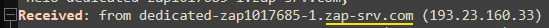

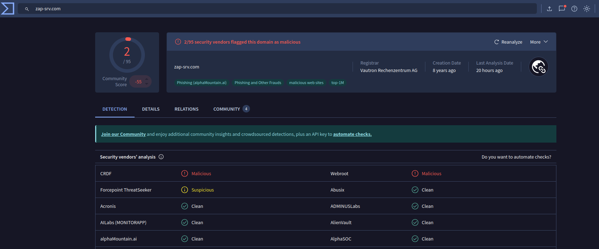
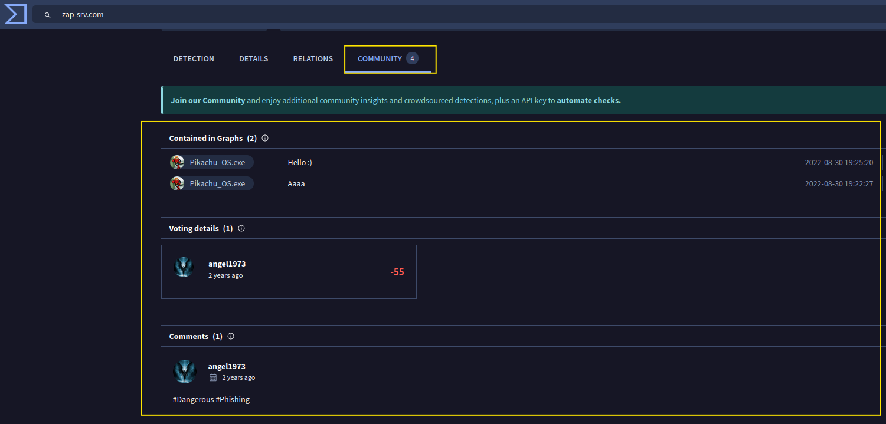

- **Actual source**: zap-srv.com
- **NOT** Trust Wallet

### Spoofed Sender

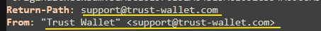
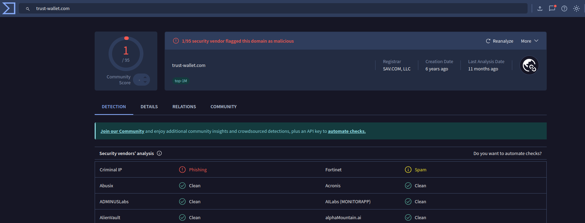
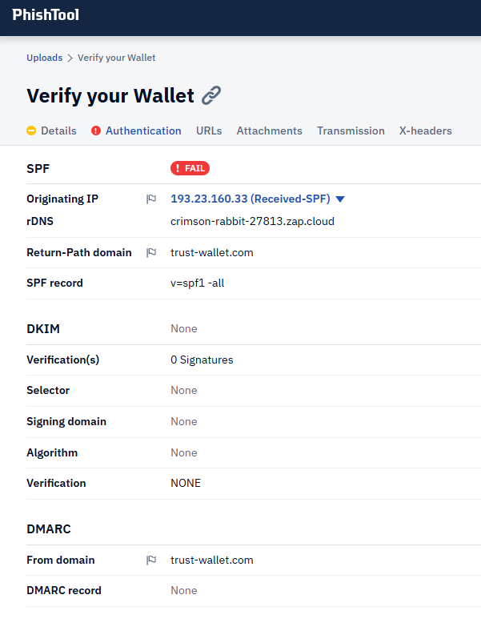

- Sender address is **faked**

### Authentication Results

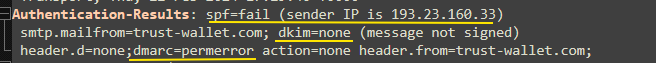
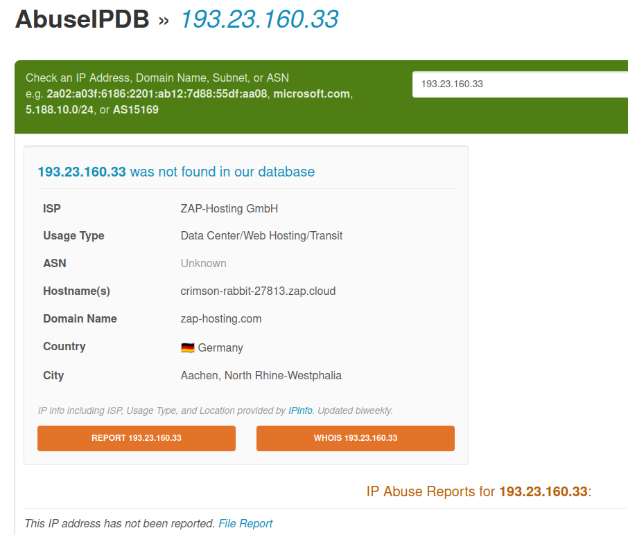

- **SPF**: FAIL -> trust-wallet.com did not authorize 193.23.160.33
- **DKIM**: NONE -> no signature
- **DMARC**: ERROR -> spoof attempt confirmed

---

## Email Content Analysis

### Social Engineering

- Subject used urgency

- Fake warning

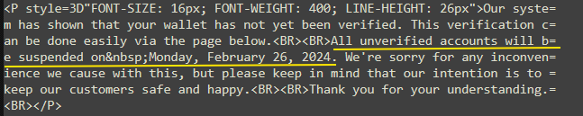

- **Goal**: push user to click without thinking.

### Malicious Links Found

- Primary malicious URL

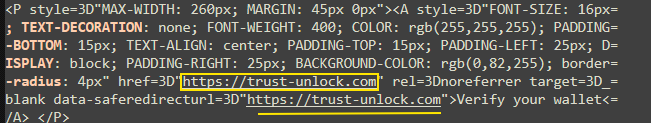
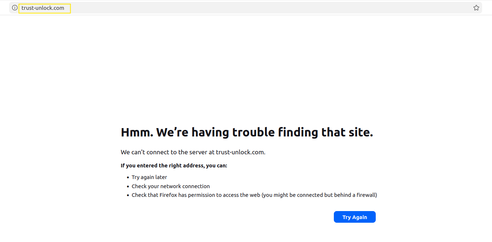

- Additional fake domains observed: `trustwllet.com  or trustwallet.support`
- All impersonating Trust Wallet.

### Fake Attachment

**Name**: Detailsdisable-262340.pdf
**Actual type**: HTML disguised as PDF

- Evidence: `Base64 decoding -> HTML with redirect + fake button`

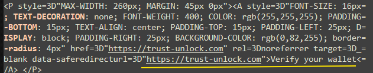

- The PDF is a phishing landing page.

---

## Attack Chain

- Attacker sends spoofed email from zap-srv.com
- Victim receives email pretending to be Trust Wallet
- Victim clicks link or opens fake PDF
- Redirected to phishing page mimicking Trust Wallet
- Page requests seed phrase / private keys
- Wallet becomes compromised

---

## Indicators of Compromise

| **Type**                 | **Value**                                                   |
| ------------------------ | ----------------------------------------------------------- |
| **Source IP**            | 193.23.160.33                                               |
| **Server Name**          | dedicated-zap1017685-1.zap-srv.com                          |
| **Malicious Domain**     | trust-unlock.com                                            |
| **Fake Attachment**      | disable-262340.pdf (HTML)                                   |
| **Spoofed Email**        | [support@trust-wallet.com](mailto:support@trust-wallet.com) |
| **Related Fake Domains** | trustwllet.com, trustwallett.support                        |

---

## Evidence - Extracts

### Header Evidence

`Received: from dedicated-zap1017685-1.zap-srv.com (193.23.160.33) spf=fail`

### HTML Evidence

`<a href="https://trust-unlock.com" style="background:#0052FF;color:#fff;">Verify your wallet</a>`

### Phishing Behavior

`Please enter your seed phrase to complete verification`

---

## SOC Actions

- Blocked IP 193.23.160.33
- Blocked domain trust-unlock.com and related
- Quarantined email
- Added IOCs to SIEM
- Verified no user clicked link

---

## Recommendations

### For Users

- Never share seed phrase / private keys
- Trust Wallet does not send verification emails
- Always verify via official app only

### For IT/SOC

- Block malicious domains + IPs
- Train users to detect crypto phishing
- Enable advanced phishing protection policies
